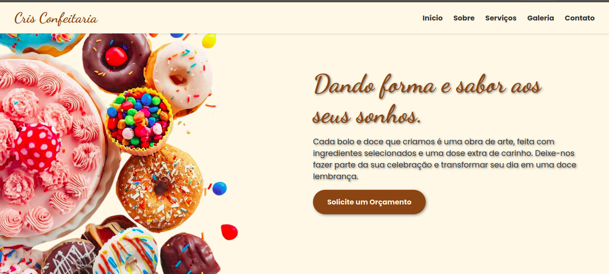

#  Cris Confeitaria - Landing Page


Uma landing page responsiva e moderna desenvolvida para a "Cris Confeitaria", uma confeitaria artesanal. O projeto tem como objetivo apresentar os produtos e serviços da confeiteira, exibir seu portfólio de forma dinâmica e facilitar o contato para orçamentos.

**⭐ Confira a demonstração ao vivo:** [**insira o link do seu site aqui quando estiver online**]


*(Dica: Para criar este screenshot, abra o site no seu navegador, tire um print da tela inteira e salve o arquivo como `screenshot.png` na pasta principal do seu projeto).*

---

## 📜 Sobre o Projeto

Este projeto foi construído do zero utilizando as tecnologias web fundamentais (HTML, CSS e JavaScript) com foco em um design elegante, minimalista e que refletisse a identidade visual da confeitaria. A página é totalmente responsiva, adaptando-se a desktops, tablets e smartphones, com atenção especial à experiência do usuário em cada dispositivo.

## ✨ Principais Funcionalidades

* **Design Responsivo:** Layout fluido que se adapta perfeitamente a qualquer tamanho de tela.
* **Navegação Fixa (Sticky):** O menu de navegação permanece no topo da página durante a rolagem para fácil acesso.
* **Scroll Suave:** Navegação suave entre as seções ao clicar nos links do menu.
* **Galeria Infinita Animada:** Um carrossel de imagens contínuo e automático, criado com CSS puro para máxima performance, exibindo os trabalhos da confeiteira.
* **UI Moderna:** Efeitos de hover, cards com design limpo, tipografia elegante e ícones (Font Awesome) que enriquecem a interface.
* **Formulário de Contato Funcional:** Campos com validação nativa (`required`) e um alerta de confirmação em JavaScript ao enviar um orçamento.
* **Otimização de SEO:** Uso de tags semânticas, meta tags de descrição e palavras-chave, e atributos `alt` nas imagens para melhor ranqueamento.

## 🚀 Tecnologias Utilizadas

O projeto foi construído com as seguintes tecnologias:

* **Frontend:**
    * `HTML5` (com foco em semântica e acessibilidade)
    * `CSS3` (utilizando Variáveis, Flexbox, Animações `@keyframes` e Media Queries)
    * `JavaScript` (Vanilla JS para manipulação do DOM e eventos)

* **Ferramentas e Bibliotecas:**
    * **Google Fonts:** Para as fontes personalizadas (`Poppins`, `Dancing Script`, `Josefin Sans`).
    * **Font Awesome:** Para a biblioteca de ícones.

## ⚙️ Como Executar o Projeto

Este é um projeto estático, portanto não necessita de um servidor complexo para ser executado.

1.  Clone o repositório para a sua máquina local:
    ```bash
    git clone [https://github.com/seu-usuario/cris-confeitaria.git](https://github.com/seu-usuario/cris-confeitaria.git)
    ```
2.  Navegue até a pasta do projeto:
    ```bash
    cd cris-confeitaria
    ```
3.  Abra o arquivo `index.html` diretamente no seu navegador.
    * **Dica:** Para uma melhor experiência de desenvolvimento, utilize a extensão "Live Server" no Visual Studio Code, que atualiza a página automaticamente a cada alteração.

## 📂 Estrutura de Arquivos

A estrutura do projeto é simples e organizada da seguinte forma:

```
cris-confeitaria/
├── assets/
│   ├── BannerCris.png
│   ├── Cris.png
│   └── ... (as 44 imagens da galeria)
├── index.html
├── style.css
└── script.js
└── README.md
```

## ⚖️ Licença

Este projeto está sob a licença MIT. Veja o arquivo [LICENSE](LICENSE) para mais detalhes.

## 👨‍💻 Contato

Desenvolvido por **Fernando Lima**.

[](https://linkedin.com/in/araujo-dev)